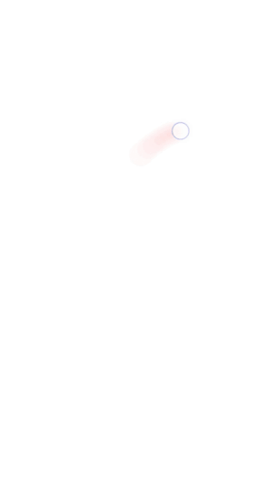

# FingerDraw
FingerDraw(Java) for visualizing finger movements
 

## Add to your project
Add the jitpack maven repository
```
allprojects {
  repositories {
    ...
    maven { url 'https://jitpack.io' }
  }
}
``` 
Add the dependency
```
dependencies {
  implementation 'com.github.slaviboy:FingerDraw:0.1.0'
}
```


## Documentation
### Examples
Add canvas to your **xml** and you are ready to go !!!
```xml
<com.slaviboy.fingerdraw.Canvas
  android:id="@+id/canvas"
  android:layout_width="match_parent"
  android:layout_height="match_parent" />

```

### Customize Paths and Circles 
You can create custom paths and circle using the main constructor method, or using the builder class.
When you want to set all properties use the main constructor method, and if you want to use the default
values and set only certain properties use the **Builder** class.

```JAVA
Canvas canvas = findViewById(R.id.canvas);

// set custom paths
canvas.setPaths(new Path[]{
  new Path(Color.RED, 2, 4, 70,100, 25),                   // using constructor
  new Path.Builder().withColor(Color.BLUE).build()         // using builder
});

// set custom circle
canvas.setCircles(new Circle[]{
  new Circle.Builder().withStrokeColor(Color.RED).build(), // using builder
  new Circle(Color.BLUE, Color.WHITE, 1,25, 255, 150)      // using constructor
});

```

### Path Properties
* **color** - *(default:Color.BLACK)* path color
* **pathType** - *(default:SMALLER_NEAR_FINGER)* determines if path should be thicker or thinner, closer to the finger
* **opacity** - *(default:4)* opacity
* **strokeWidth** - *(default:70)* stroke width for the path
* **fadeOutDuration** - *(default:200)* how many (ms) the fade out effect should take
* **maxNumSegments** - *(default:25)* maximum number of segmental paths

### Circle Properties
* **strokeColor** - *(default:Color.BLACK)* stroke color
* **fillColor** - *(default:Color.WHITE)* fill color
* **strokeWidth** - *(default:Color.1)* stroke width
* **opacity** - *(default:4)* opacity
* **radius** - *(default:25)* radius
* **cx** - *(default:0)* center x coordinate
* **cy** - *(default:0)* center y coordinate
* **fadeOutDuration** - *(default:200)* how many (ms) the fade out effect should take
